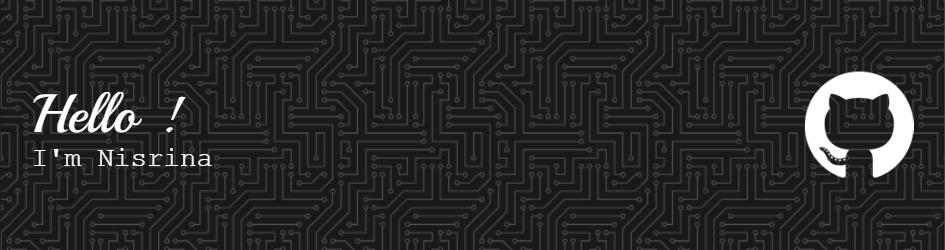

🎓 Computer Engineering Graduate | Universiti Malaysia Perlis (UniMAP)  
🤖 Tech Enthusiast & AI Explorer | Passionate about transforming ideas into intelligent solutions 

<h3>🌟 A Bit About Me</h3>
🧠 I love exploring cutting-edge AI technologies and solving problems with deep learning 
🌐 Experienced in web development, programming, and creating real-world AI applications 
🌍 Active participant in exchange programs, workshops, and tech communities 

<h3>📬 Let's Connect!</h3>

📧 [Email](nisrinatanjung11@gmail.com) 
🌐 [LinkedIn](https://www.linkedin.com/in/siti-nisrina/) 

<h3>🚀 Languages and Tools I Use</h2>

